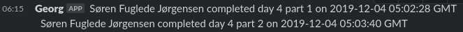

# Advent of Code announcer

This script allows you to post leaderboards and new solution submissions from a collection of private leaderboards to a collection of Slack or MS Teams channels.

## Setup

Rename `config.json.example` to `config.json` and include the following information:

* For each leaderboard:
  * The ID of the leaderboard. This is the final part of the URL you use to view the private leaderboard in a browser.
  * The URL for a [Slack webhook](https://api.slack.com/messaging/webhooks) or an [MS Teams webhook](https://docs.microsoft.com/en-us/microsoftteams/platform/webhooks-and-connectors/how-to/add-incoming-webhook) where messages should be posted.
* Your Advent of Code session ID. In Firefox or Chromium, this can be found by clicking F12, navigating to the "Network" tab, making a request to https://adventofcode.com, and clicking "Cookies" on the request.

## Usage

To post the current leaderboard, run

    python -m aocannounce --leaderboard

and to post all puzzle solutions that have been submitted since the last run, run

    python -m aocannounce --newscores

You may then wish to run the script as a cronjob. Be aware that requests are only allowed every 15 minutes, so make sure not to run your script more often than that.
